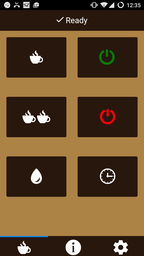
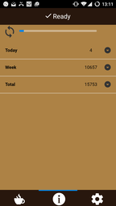
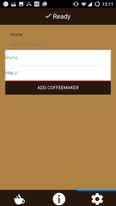

# CofFi

CofFi lets you control a JURA coffeemaker (tested with Impressa E50) over WiFi via an WebApp for Android and IOS.

It uses a [Wemos D1 mini](https://www.wemos.cc/product/d1-mini.html) for the WiFi connection of the coffeemaker, but should work with other ESP-8266 chips as well.

Communication with the coffeemaker is based on Oliver Krohns [Coffeemaker-Payment-System] (https://github.com/oliverk71/Coffeemaker-Payment-System) and 

The app is made with [Phonon framework] (https://github.com/quark-dev/Phonon-Framework).

Icons: [Ionicons] (https://github.com/driftyco/ionicons)

## Features

* Turn the coffeemaker on or off
* Flush
* Make one or two coffee
* See the current status (ready, need water, off, etc...)
* See statistics (# cups, # flushs, daily, weekly, total)
* Read Eeprom 
* OTA update

TODO: 
* Implement scheduled tasks
* Make better setup instructions

## Setup

Connect the WiFi chip to the coffeemakers serial interface using a voltage divider.
The Impressa E50 has a four pin interface (details [here](http://protocoljura.wiki-site.com/index.php/Serial_interfaces#four-pin_interface))
Pins on Wemos D1: D2, D1 - RX, TX from coffeemaker 
(D2 = GPIO4 on ESP8266; D1 = GPIO5 on ESP8266).

Push the sketch to your WiFi chip. From now you can update via web.

Put the app into your web server folder. I use Apache as a webserver.

Look at the app with your mobile browser and "Add to Homescreen".

Add the IP address of your coffeemaker to the App.

